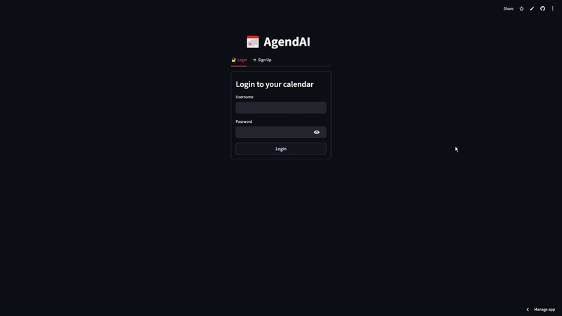
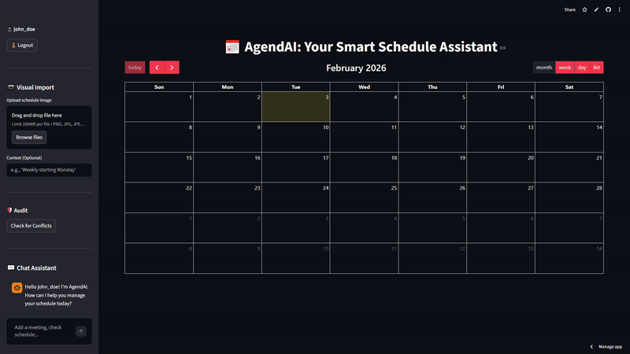
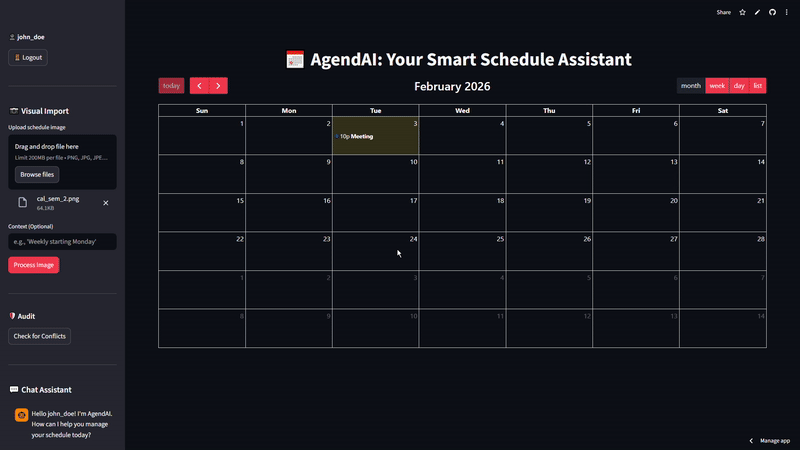
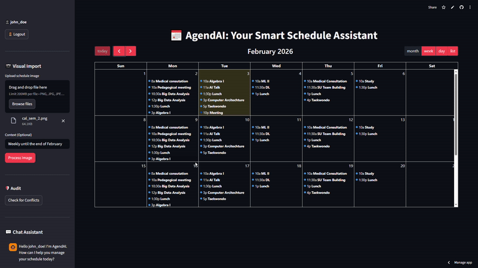
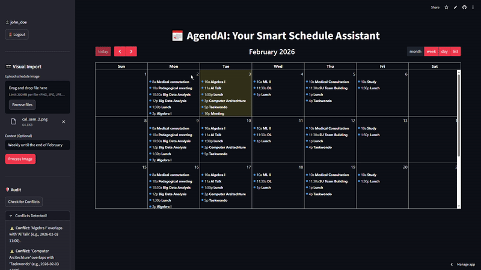

# 📅 AgendAI: Your Smart Schedule Assistant

[](https://agendai.streamlit.app/)
[](https://www.python.org/downloads/)
[](https://ai.google.dev/)

AgendAI is a calendar management platform that leverages the power of Gemini 3.0 Flash to transform how you interact with your schedule. From natural language chat to visual schedule extraction, AgendAI acts as a proactive personal assistant.

## Overview

Managing a busy schedule often involves manual data entry and constant context switching. AgendAI solves this by providing a unified interface where users can "talk" to their calendar. Whether you're uploading a screenshot of a university timetable or asking about potential overlapping events next Tuesday, AgendAI handles the complexity in the background.

## Features

- **Natural Language Assistant:** Manage your schedule naturally. Beyond simple additions, the assistant understands complex intent, relative dates ("next Friday"), and recurring events. You can ask it to "Reschedule my 2 PM meeting to 4 PM," "Clear my Friday afternoon," or "Summarize my week," and it handles the database logic automatically.
- **Visual Schedule Import:** Upload images (PNG, JPG, WebP, JPEG) of physical or digital schedules. The system automatically extracts events and populates your calendar.
- **Smart Conflict Audit:** A built-in logic engine that identifies overlapping commitments through a simple click. It works for both recurrent and single events.
- **Real-time Synchronization:** A dynamic calendar interface that displays your entire schedule in monthly, weekly, or daily views. It updates instantly as you interact with the AI agent.
- **Secure Multi-User Environment:** AgendAI is built with privacy at its core. Its authentication system ensures complete data isolation between users. Each calendar is strictly tied to a unique user account, meaning your schedule, personal events, and command history remain private and inaccessible to others

## Tech Stack

**Backend & Logic:**
- **Python:** The core programming language.
- **Google Gemini 3.0 Flash:** Used for conversational tool-calling.
- **Google Gemini 2.0 Flash:** Used for multimodal vision extraction.
- **SQLite:** A lightweight, reliable database for user accounts and event storage.

**Frontend:**
- **Streamlit:** For the interactive web dashboard.
- **Streamlit-Calendar:** Integration of FullCalendar for a native scheduling experience.

**Observability & AI Tooling:**
- **Langfuse:** For tracing AI generations and monitoring tool-calling performance.
- **Pillow (PIL):** For image pre-processing before AI analysis.

## Architecture (High Level)

AgendAI follows a strict **3-Tier Architecture** to ensure clean separation of concerns and system security:

1. **Presentation Layer (UI):** A Streamlit-based interface that captures user input and displays the calendar. It is "decoupled," meaning it sends raw data to the services without knowing how the database or AI functions.
2. **Service Layer (Orchestration):** The `CalendarService` acts as the brain. It coordinates between the UI, the AI Agent, and the Database. It ensures that when an image is processed, both the database and the AI's "memory" are updated simultaneously.
3. **Data & Tool Layer:** A collection of specialized tools (CRUD operations, Vision extraction) that interact directly with the database and APIs.

*Note: For a detailed deep-dive into design decisions and security implementations (like User ID binding), please refer to [ARCHITECTURE.md](./docs/ARCHITECTURE.md).*

## Installation & Setup

### Prerequisites
- Python 3.9+
- A Google AI Studio API Key (for Gemini)
- Langfuse API Keys (for observability)

### Installation Steps

1. **Clone the repository:**
```bash
git clone https://github.com/thepalhoto/ai-calendar--AgendAI-
cd agendai
```

2. Install dependencies:
```bash
pip install -r requirements.txt
```

3. Set up environment logic:
```
1. Go to your Streamlit Cloud Dashboard.
2. Find your app and click on the three dots (⋮) next to it.
3. Select Settings.
4. On the left sidebar, click Secrets.
5. In the text area you can find the API keys currently being used.
```

**Required environment variables:**
```
GOOGLE_API_KEY=your_gemini_api_key_here
LANGFUSE_PUBLIC_KEY=your_langfuse_public_key
LANGFUSE_SECRET_KEY=your_langfuse_secret_key
LANGFUSE_HOST=https://cloud.langfuse.com
```

4. Run the application:
```bash
streamlit run streamlit_app.py
```

## Usage

AgendAI simplifies schedule management through an intuitive, AI-driven interface. Below is a guide on how to interact with the platform:

### 1. Secure Authentication
AgendAI ensures data isolation. Each user maintains a private, secure database of their events.
* **Sign Up:** Create a new account to get started.
* **Log In:** Access your personalized calendar securely.

**Sign Up:**
<p align="center">
  
</p>

**Log In:**
<p align="center">
  
</p>

---

### 2. Natural Language Scheduling
Talk to your calendar naturally. The assistant understands complex intent, relative dates (e.g., "next Friday"), and recurring events.
* **Try saying:** *"Add a project meeting next Tuesday at 2 PM,"* or *"Move my 2 PM meeting to 4 PM."*

<p align="center">
  
</p>

---

### 3. Visual Schedule Import
Upload images (PNG, JPG, WebP) of physical or digital schedules. The system uses **Gemini 2.0 Flash** to automatically extract events and populate your calendar.

<p align="center">
  
</p>

---

### 4. Interactive Display, Audit & Logout
Visualize your commitments, maintain a clash-free schedule, and manage your session securely.

**Calendar Display:**
<p align="center">
  
</p>

**Conflict Audit:**
<p align="center">
  
</p>

**Secure Logout:**
<p align="center">
  
</p>

---

## Deployment

**Live Application:** (https://agendai.streamlit.app/)

**Deployment Platform:** Streamlit Cloud

Instructions for deploying your own instance (if applicable).

## Project Structure

```
ai-calendar--AgendAI-/
├── assets/                # Project assets (Demo GIFs & Test Calendars)
│   ├── cal_mensais/       # Monthly calendar test images
│   ├── cal_semanais/      # Weekly calendar test images
│   ├── Streamlit-Addsingleevent....gif
│   ├── Streamlit-Audit....gif
│   ├── Streamlit-CalendarDisplay....gif
│   ├── Streamlit-LogIn....gif
│   ├── Streamlit-LogOut....gif
│   ├── Streamlit-SignUp....gif
│   └── Streamlit-VisualImport....gif
├── streamlit_app.py       # Main application entry point & UI
├── src/                   # Agent initialization and core logic
│   └── agent.py           # AI Agent configuration
├── services/              # Business logic layer
│   └── calendar_service.py # Orchestrator for tools and UI
├── tools/                 # Specialized tool implementations
│   ├── api_client.py      # Gemini API wrappers
│   ├── calendar_ops.py    # Calendar CRUD operations
│   ├── database_ops.py    # Database & User management
│   └── document_extraction.py # Vision/PDF extraction
├── config/                # Configuration assets
│   ├── constants.py       # Global constants
│   └── prompts.py         # System prompts
├── data/
│   └── scheduler.db       # SQLite database (Users & Events)
├── utils/                 # Utility scripts
│   ├── check_db.py        # Database inspection script
│   ├── create_user.py     # Manual user creation script
│   └── generate_requirements.py # Dependency management
├── docs/                  # Documentation
│   ├── ARCHITECTURE.md    # System design documentation
│   └── TOOLS.md           # Tool definitions and usage
└── requirements.txt       # Dependencies

```

> **Note:** The `assets/cal_mensais` and `assets/cal_semanais` folders contain example calendar images. These are provided for testing the **Visual Import** feature (e.g., for the professor's evaluation).


## Technical Considerations

* **Recurrence Handling:** Robustly supports standard daily, weekly, and monthly patterns; complex, non-standard intervals may require manual verification.
* **Visual Extraction Limits:** High-resolution digital screenshots yield the best results. Low-quality photos or certain calendar layouts may lead to extraction errors, as they are unclear to the model.
* **Read-Only Interface:** To ensure data consistency between the AI agent and the database, the calendar display operates on a read-only scheme; users cannot manually drag-and-drop slots.
* **Global Timezone Baseline:** Currently operates on a standardized UTC/Server-side time baseline to maintain consistency across different user environments.

## Future Work

* **Voice Command Integration**: AgendAI could integrate Speech-to-Text (STT) to allow hands-free scheduling. By using Streamlit's audio recorder and Google Gemini's multimodal capabilities, the agent could ingest raw audio commands and execute them directly, removing the need for keyboard input.

* **Google Calendar Sync:** Implementing 2-way synchronization with external calendar providers (Google, Outlook, Apple) to ensure mobile accessibility.


## Team

- Carlota Fradinho e Silva - Frontend & UX Engineer
- Gonçalo Palhoto - Backend & Tools Engineer 
- Gonçalo Morais - AI & Logic Engineer